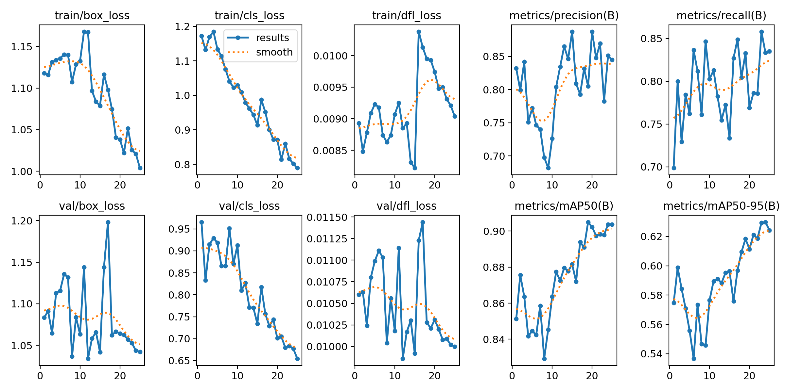
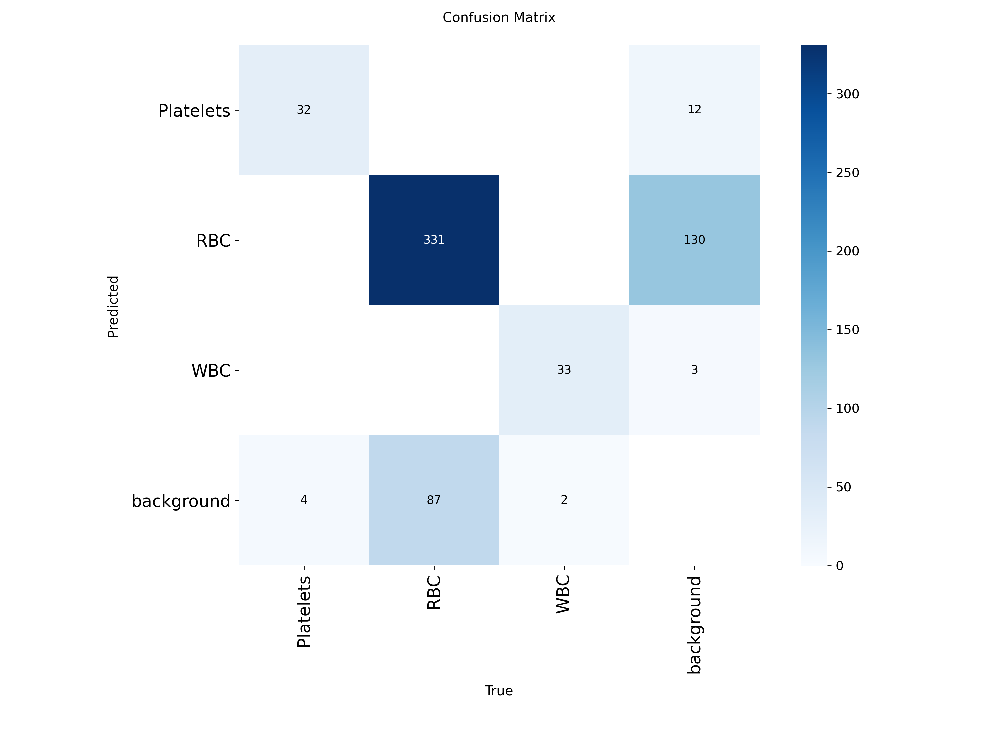

# Mini Project VII - Object Detection in Medical Imaging
BCIT Master of Science - Applied Computing : COMP 9130 - Applied Artificial Intelligence Mini Project 7

## Problem Description
The diagnosis of blood-based diseases often involves identifying and characterizing patient blood samples. 

Classifying blood cell subtypes have important medical applications. 

## Dataset Source
Blood Cell Computer Vision Dataset https://universe.roboflow.com/mazhar-cakir/blood-cell-bsyfg

classes:

    WBC (While Blood Cells)
    RBC (Red Blood Cells)
    Platelets

🔹 TRAIN split: 292 images
🔹 VALID split: 36 images
🔹 TEST split: 36 images

364 images total
## Results Summary with Key Metrics

    BLOOD CELL DETECTION METRICS
    -----------------------------------------------------------
    CLASS       |  mAP@50  | mAP@50-95 | PRECISION |  RECALL  |
    ------------|----------|-----------|-----------|----------|
    Platelets   |  0.8892  |  0.4712   |  0.7878   |  0.8251  | 
    RBC         |  0.7876  |  0.5924   |  0.7950   |  0.7330  | 
    WBC         |  0.9682  |  0.8277   |  0.9704   |  0.9383  |     
    OVERALL     |  0.8816  |  0.6305   |  0.8511   |  0.8321  | 

## Setup instructions
    git clone <this repo>
    cd mini-project-4
    python -m venv .venv
    source .venv/Scripts/activate or .venv/bin/activate
    pip install -r requirements.txt

run .ipynb files with a created python environment.

## Team Member Contributions
Group 8

Ian: Analysis Requirements

Jun: Technical Requirements

Tohether: Learning Hub Report